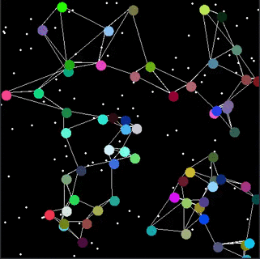
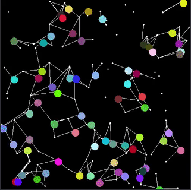

Hi! 

I'm Vivek and I love programming! 

Email me at vivek.thazhathattil@gmail.com

 **Languages and Tools:**

 <code></code>
<code></code>
<code></code>

 **Cool stuff from one of my projects I'm working on:**

